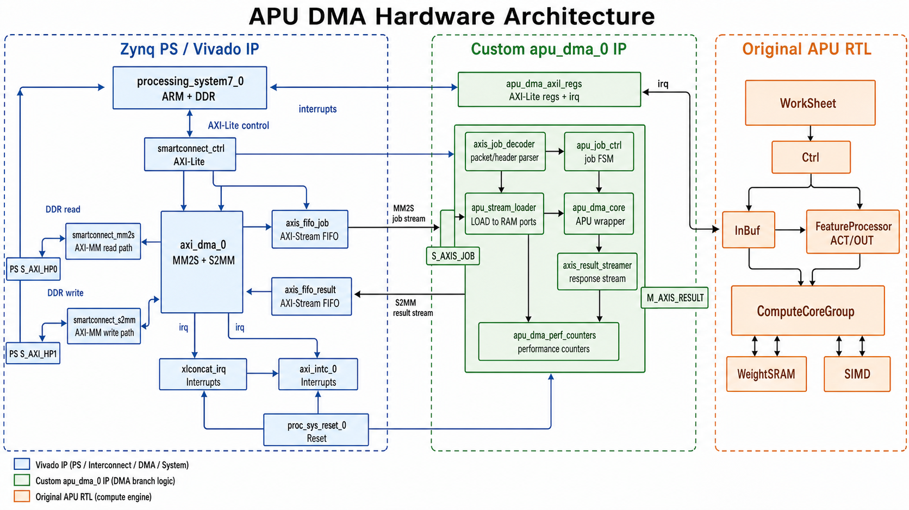
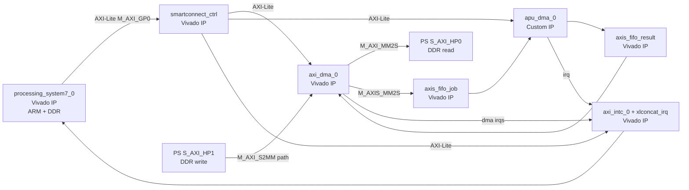
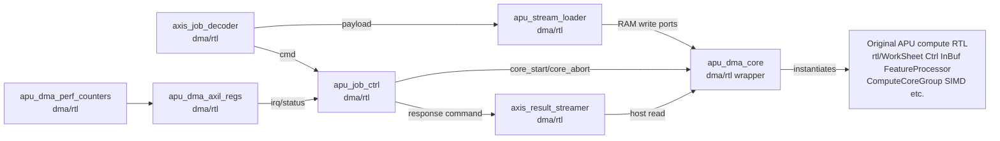

# Hardware Block Diagram

本文用框图区分 DMA 支线里哪些是 Vivado IP，哪些是本项目 RTL。

生成版硬件框图如下，适合快速建立整体印象；后面的 ASCII/Mermaid 图和表格是精确说明。



先记住一个总原则：

```text
Vivado Block Design 里看到的 apu_dma_0 是一个自定义 IP。
这个自定义 IP 内部才是你写的 RTL。
AXI DMA、PS7、SmartConnect、FIFO、中断控制器等是 Vivado/Xilinx IP。
```

## 1. Top-Level Vivado Block Design

```text
                         PYNQ PS / ARM / DDR
                 +--------------------------------+
                 | processing_system7_0           |
                 |                                |
                 |  M_AXI_GP0    S_AXI_HP0 HP1    |
                 |     |             ^      ^     |
                 |     |             |      |     |
                 +-----|-------------|------|-----+
                       |             |      |
                       | AXI-Lite    |      | AXI4-MM to DDR
                       v             |      |
             +-------------------+   |      |
             | smartconnect_ctrl |   |      |
             +---+-----------+---+   |      |
                 |           |       |      |
                 |           |       |      |
                 v           v       |      |
        +-------------+  +-------------+    |
        | axi_dma_0   |  | apu_dma_0   |    |
        | S_AXI_LITE  |  | S_AXI_CTRL  |    |
        +------+------+  +------+------+    |
               |                |           |
               |                |           |
               |                v           |
               |         +-------------+    |
               |         | axi_intc_0  |<---+-- xlconcat_irq
               |         +-------------+
               |
               | MM2S AXI4-MM read
               v
       +-------------------+       +----------------+
       | smartconnect_mm2s |------>| PS S_AXI_HP0   |
       +-------------------+       +----------------+

       DDR job buffer
             |
             | AXI DMA MM2S stream
             v
       +-------------+      +----------------+      +----------------+
       | axi_dma_0   |----->| axis_fifo_job  |----->| apu_dma_0      |
       | M_AXIS_MM2S |      | AXIS FIFO      |      | S_AXIS_JOB     |
       +-------------+      +----------------+      +----------------+

       +----------------+      +-------------------+      +-------------+
       | apu_dma_0      |----->| axis_fifo_result  |----->| axi_dma_0   |
       | M_AXIS_RESULT  |      | AXIS FIFO         |      | S_AXIS_S2MM |
       +----------------+      +-------------------+      +------+------+
                                                            |
                                                            | AXI4-MM write
                                                            v
                                                  +-------------------+
                                                  | smartconnect_s2mm |
                                                  +-------------------+
                                                            |
                                                            v
                                                     PS S_AXI_HP1
                                                            |
                                                            v
                                                     DDR response buffer
```

## 2. Top-Level Classification

| Block | 来源 | 作用 |
| --- | --- | --- |
| `processing_system7_0` | Vivado/Xilinx IP | Zynq PS，运行 Linux/Python，连接 DDR |
| `axi_dma_0` | Vivado/Xilinx IP | DDR 和 AXI-Stream 之间搬运数据 |
| `smartconnect_ctrl` | Vivado/Xilinx IP | PS 到 AXI-Lite 从设备的控制总线 |
| `smartconnect_mm2s` | Vivado/Xilinx IP | AXI DMA MM2S 读 DDR 的 AXI-MM 通路 |
| `smartconnect_s2mm` | Vivado/Xilinx IP | AXI DMA S2MM 写 DDR 的 AXI-MM 通路 |
| `axis_fifo_job` | Vivado/Xilinx IP | 输入 AXI-Stream FIFO |
| `axis_fifo_result` | Vivado/Xilinx IP | 输出 AXI-Stream FIFO |
| `axi_intc_0` | Vivado/Xilinx IP | AXI interrupt controller |
| `xlconcat_irq` | Vivado/Xilinx IP | 合并 DMA 和 APU DMA 中断 |
| `proc_sys_reset_0` | Vivado/Xilinx IP | 生成同步复位 |
| `apu_dma_0` | 你封装的自定义 IP | 内部由 `dma/rtl` 和基础 `rtl` 组成 |

## 3. Custom `apu_dma_0` Internal Block Diagram

`apu_dma_0` 是你自己的硬件核心。它在 Vivado 里表现为一个 IP，但 IP 内部源码来自本项目。

```text
                       apu_dma_0 custom IP
+-----------------------------------------------------------------------+
|                                                                       |
|  S_AXIS_JOB                                                           |
|      |                                                                |
|      v                                                                |
|  +------------------+        cmd         +------------------+         |
|  | axis_job_decoder |------------------->| apu_job_ctrl     |         |
|  | dma/rtl          |                    | dma/rtl          |         |
|  +---------+--------+                    +----+--------+----+         |
|            | payload                          |        |              |
|            v                                  |        |              |
|  +------------------+                         |        |              |
|  | apu_stream_loader|                         |        |              |
|  | dma/rtl          |                         |        |              |
|  +---+---+---+---+--+                         |        |              |
|      |   |   |   |                            |        |              |
|      |   |   |   | RAM write ports            |        | response cmd |
|      v   v   v   v                            v        v              |
|  +-------------------------+        +-----------------------+          |
|  | apu_dma_core           |<-------| axis_result_streamer  |          |
|  | dma/rtl wrapper        | host   | dma/rtl               |          |
|  | + original APU RTL     | read   +-----------+-----------+          |
|  +-----------+-------------+                    |                      |
|              |                                  v                      |
|              |                           M_AXIS_RESULT                 |
|              |                                                         |
|              v                                                         |
|  +-------------------------------------------------------------+       |
|  | Original APU compute modules                               |       |
|  | rtl/WorkSheet.sv                                           |       |
|  | rtl/Ctrl.sv                                                |       |
|  | rtl/InBuf.sv                                               |       |
|  | rtl/FeatureProcessor.sv                                    |       |
|  | rtl/ComputeCoreGroup.sv                                    |       |
|  | rtl/ComputeCore.sv / Multiplier.sv / AdderTree.sv          |       |
|  | rtl/Accumulator.sv                                         |       |
|  | rtl/WeightSRAM.sv / WeightBuffer.sv                        |       |
|  | rtl/SIMD.sv                                                |       |
|  +-------------------------------------------------------------+       |
|                                                                       |
|  +-----------------------+       +----------------------+              |
|  | apu_dma_perf_counters|------>| apu_dma_axil_regs   |<-- S_AXI_CTRL|
|  | dma/rtl              |       | dma/rtl              |              |
|  +-----------------------+       +----------+-----------+              |
|                                             |                          |
|                                             v                          |
|                                            irq                         |
+-----------------------------------------------------------------------+
```

## 4. Inside `apu_dma_0`: Which RTL Is New

这些是 DMA 支线新增的 RTL，位于 `dma/rtl/`：

| File | 作用 |
| --- | --- |
| `apu_dma_top.sv` | 自定义 IP 顶层，连接 AXIS、AXI-Lite、内部模块 |
| `apu_dma_pkg.sv` | job/packet/header/状态码等协议常量 |
| `axis_job_decoder.sv` | 解析输入 AXI-Stream job |
| `apu_stream_loader.sv` | 把 LOAD payload 写入 APU 内部 RAM |
| `apu_job_ctrl.sv` | job 主状态机，调度 LOAD/RUN/READ_RESULT/END_JOB |
| `apu_dma_core.sv` | 包装原始 APU core，提供 DMA 写 RAM、启动、读结果接口 |
| `axis_result_streamer.sv` | 把 READ_RESULT/FINAL/ERROR 变成输出 AXI-Stream response |
| `apu_dma_axil_regs.sv` | AXI-Lite 状态寄存器、中断和性能计数器映射 |
| `apu_dma_perf_counters.sv` | 统计 RX/TX 字节、busy cycles、stall cycles |

这些 RTL 的目标是让原始 APU 能被 AXI DMA 喂数据、启动、读结果。

## 5. Inside `apu_dma_0`: Which RTL Is Original APU

这些是基础 APU ASIC 的原始计算 RTL，位于顶层 `rtl/`，被 `apu_dma_core.sv` 例化或间接使用：

| File | 作用 |
| --- | --- |
| `WorkSheet.sv` | 指令 RAM 和指令顺序发射 |
| `Ctrl.sv` | APU 计算调度、地址生成、写回控制 |
| `InBuf.sv` | 输入数据选择、锁存、residual replay |
| `FeatureProcessor.sv` | ACT/OUT feature SRAM 读写和卷积窗口读取 |
| `ComputeCoreGroup.sv` | 64 路并行输出通道计算阵列 |
| `ComputeCore.sv` | 单输出通道计算核心 |
| `Multiplier.sv` | 二值乘法 |
| `AdderTree.sv` | 加法树归约 |
| `Accumulator.sv` | 卷积累加 |
| `WeightSRAM.sv` | 权重 SRAM |
| `WeightBuffer.sv` | 权重读出缓冲 |
| `SIMD.sv` | BN 等效比较、二值激活和输出打包 |

注意：DMA 支线没有重写卷积计算阵列。它主要是给原来的 APU 外面包了一层 DMA 数据搬运和命令调度。

## 6. Which Files Are Not Used Inside DMA IP

旧 MMIO/AHB 顶层相关 RTL 不是 DMA IP 内部主路径：

| File | 当前角色 |
| --- | --- |
| `rtl/Top_student.sv` | 基础 APU AHB/MMIO 顶层，用于原始仿真/旧方案 |
| `rtl/ahb_slave_top.sv` | 旧 AHB wrapper |
| `rtl/ahb_slave.sv` | 旧 AHB slave |
| `rtl/addr_map.sv` | 旧 AHB 地址译码 |
| `rtl/ram_mux.sv` | 旧 AHB 和 APU 对 RAM 控制权复用 |

DMA 支线使用 `apu_dma_core.sv` 直接例化原始 APU 的计算模块，而不是继续走旧 AHB slave。

## 7. Software and Hardware Boundary

软件看到的硬件边界是：

```text
AXI DMA registers at 0x4040_0000
apu_dma registers at 0x43C0_0000
interrupt controller at 0x4180_0000
DMA TX/RX buffers in DDR
```

软件不会直接看到：

- `axis_job_decoder`
- `apu_stream_loader`
- `apu_job_ctrl`
- `WorkSheet`
- `Ctrl`
- `FeatureProcessor`
- `ComputeCoreGroup`

这些是 PL 内部 RTL。

软件通过 job buffer 间接控制它们：

```text
Python packet header
  -> axis_job_decoder
  -> apu_job_ctrl
  -> loader/core/result streamer
```

## 8. Mermaid Diagram

如果 Markdown 查看器支持 Mermaid，可以用下面这张图看层次：





## 9. Short Answer

如果只用一句话区分：

```text
Vivado IP 负责 PS、DDR 访问、AXI DMA 搬运、AXI 总线互联、FIFO、复位和中断控制。
你的 RTL 负责解释 job/packet、写入 APU RAM、启动 APU、读取结果、生成 response、统计状态。
基础 APU RTL 负责真正的二值神经网络卷积计算。
```
